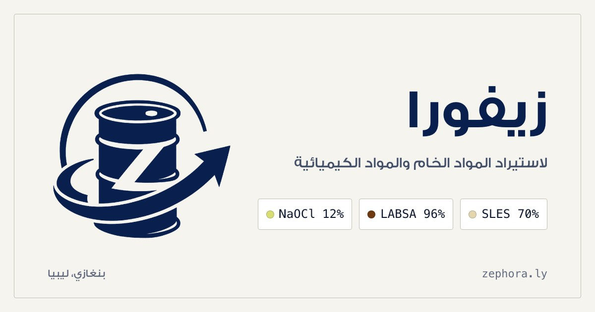

<div align="center">



# زيفورا لاستيراد المواد الخام والمواد الكيميائية

**[zephora.ly](https://zephora.ly)**

</div>

موقع تعريفي لشركة استيراد مواد خام في بنغازي، منشور على GitHub Pages.
يعرض ثلاث مواد: ‎SLES 70%‎ (الصين)، ‎LABSA 96%‎ (السعودية)، هيبوكلوريت الصوديوم ‎12%‎ (مصر).

## المزايا

- **بلا خطوة بناء عند النشر** — ملفات HTML في الجذر هي المنشورة مباشرة.
- **يعمل بدون جافاسكربت** — القائمة والأسئلة والنموذج مبنية بـ HTML/CSS؛ السكربت تحسينات فقط.
- **بلا خدمات خارجية للتتبّع** — الخطوط محلية، ولا أدوات تحليل أو إعلانات.
- **جاهز لمحركات البحث** — عنوان ووصف لكل صفحة، بيانات منظَّمة (LocalBusiness وBreadcrumb)، خريطة موقع، وبطاقة مشاركة.

## البنية

```
├── *.html               الصفحات المولَّدة (لا تُعدَّل يدويًا)
├── assets/
│   ├── css/main.css     نظام التصميم
│   ├── js/main.js       تحسينات اختيارية
│   ├── fonts/           خط GE SS Two
│   └── img/brand/       الشعار والأيقونات وبطاقة المشاركة
└── tools/
    ├── build.py          يبني الصفحات من القالب والمحتوى
    ├── pages/            محتوى كل صفحة
    ├── build_brand.py    يولّد الشعار والأيقونات من الشعار الأصلي
    └── build_social_card.sh  يصوّر بطاقة المشاركة
```

## التعديل

1. عدّل المحتوى في `tools/pages/` أو بيانات الشركة في `SITE` داخل `tools/build.py`
   (البيانات القانونية: `cr` و`tax` و`chamber` — تظهر في الموقع فور تعبئتها).
2. أعد البناء:

```bash
python3 tools/build.py
```

## المعاينة محليًا

```bash
python3 -m http.server 8000
```

ثم افتح `http://127.0.0.1:8000`.

## النشر

GitHub Pages من الفرع `main`، على النطاق المخصّص `zephora.ly` (ملف `CNAME`).
نموذج التواصل يعمل عبر FormSubmit إلى `info@zephora.ly`، ويحتاج تفعيلًا لمرة واحدة
من الرسالة التي تصل إلى البريد عند أول إرسال.
